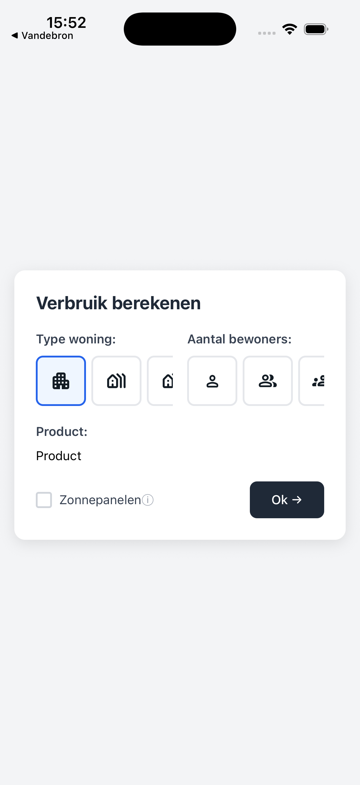
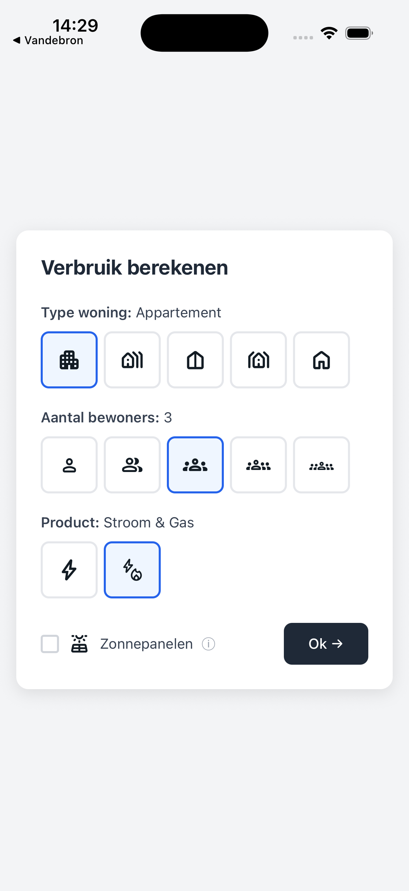

# Vandebron Mobile Developer Take-home Assessment

Thanks for applying to Vandebron — if you've made it this far we already think you're pretty great.

---

## Setup

1. `yarn`
2. `yarn start` — scan the QR code with **Expo Go** on your phone, or press `i` / `a` for simulator

---

## The task

You're working on a mobile energy consumption calculator. The existing code is a starting point — there are bugs to find, features to build, and plenty of room to make it your own.

The goal screenshot below is a reference, not a strict spec. Make it your own.

| Where you're starting | Reference |
|---|---|
|  |  |

### Areas to focus on

Pick what you'd like to focus on and implement those.

- **Fix the bugs** — there are several in the existing code. Find and fix what you can.
- **Implement `ProductSelector`** — currently a stub. Users should be able to pick between electricity-only or electricity + gas.
- **Calculate consumption** — estimate usage from the inputs. Return type: `{ electricity: number, gas?: number }`. Bigger house and more residents = higher consumption; solar panels reduce electricity. Gas should only appear when the electricity + gas product is selected.
- **Make it production-ready** — there are things you'd want to clean up before shipping.

---

## Notes

- The "Ok →" button doesn't need to navigate anywhere.
- External libraries are fine.

---

## Run tests

```bash
yarn test
```

---

## Submitting

When you're done:

1. If anything is broken or intentionally left incomplete, add a brief `NOTES.md` so we don't mistake it for an accident.
2. Zip up the project **with the `.git` folder included** and share via Google Drive, Dropbox, or similar.

We'll walk through your changes together in the interview — be ready to talk about the decisions you made.
